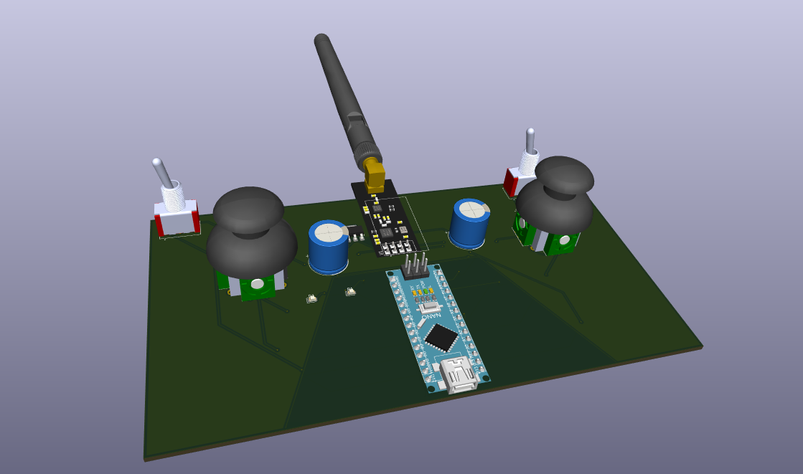
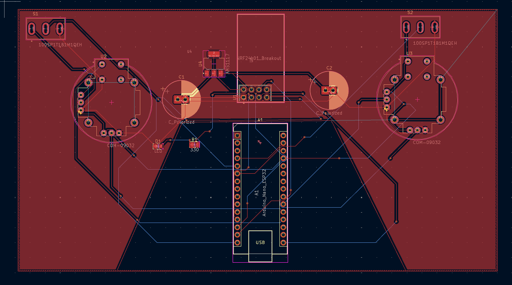
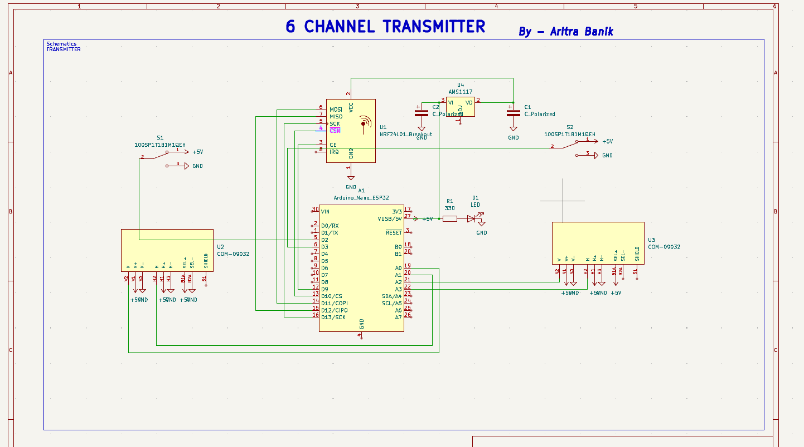
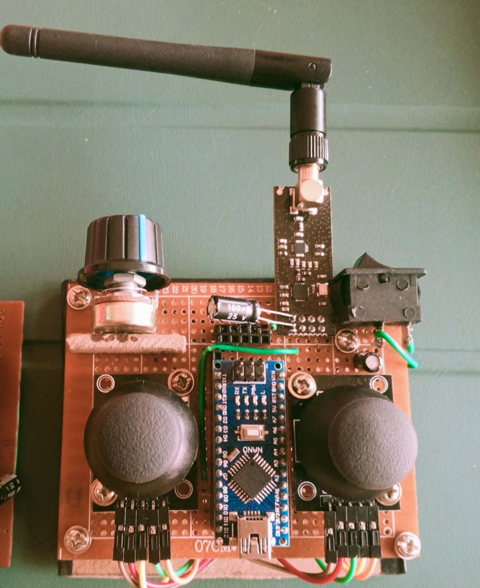
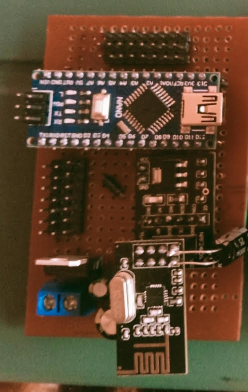

# 6-Channel nRF24L01 Wireless Transmitter


**A professional 6-channel wireless RC transmitter using Arduino Nano and nRF24L01+ RF module for remote control of drones, robots, and RC vehicles.**

> Built at **National Institute of Technology Agartala** | Apr 2025 - Present

---

## 📸 Project Gallery

The system provides precision analog control with reliable 2.4 GHz wireless communication.

| **3D PCB View** | **PCB Layout** | **Circuit Schematic** |
|:---:|:---:|:---:|
|  |  |  |
| *3D render of transmitter PCB* | *Double-sided PCB design* | *Complete circuit diagram* |
| **Transmitter** | **Receiver** |
|:---:|:---:|:---:|
|  |  |
| *Transmitter Front* | *Receiver Front* |

---

## 🛠️ Hardware Components

The transmitter is built around the Arduino Nano platform with nRF24L01+ RF module for robust wireless communication.

### Core Components

| Component | Specification | Quantity | Description |
| :--- | :--- | :---: | :--- |
| **Microcontroller** | Arduino Nano (ATmega328P) | 1 | 5V/16MHz processing |
| **RF Module** | nRF24L01+ | 1 | 2.4 GHz transceiver |
| **Joysticks** | Dual-axis analog | 3 | 6-axis control input |
| **Power Supply** | 5V regulated | 1 | USB or 7-12V battery input |
| **Decoupling Capacitors** | 10µF + 100nF | Multiple | Power stability for nRF24L01 |

### Input Configuration

| Channel | Analog Pin | Function | Control Type |
|:-------:|:----------:|:---------|:-------------|
| **CH1** | A0 | Throttle | Joystick Y-axis |
| **CH2** | A1 | Yaw | Joystick X-axis |
| **CH3** | A2 | Pitch | Joystick Y-axis |
| **CH4** | A3 | Roll | Joystick X-axis |
| **CH5** | A6 | AUX1 | Joystick Y-axis / Potentiometer |
| **CH6** | A7 | AUX2 | Joystick Y-axis / Potentiometer |

---

## 🚀 Key Features

* **6-Channel Control:** Full 6-axis control for complex RC applications
* **2.4 GHz Communication:** nRF24L01+ module with 100+ meter range (with antenna)
* **Low Latency:** 250 kbps data rate for responsive control
* **Precision Input:** 8-bit resolution (0-255) per channel
* **Auto Calibration:** Software joystick center-point mapping
* **Failsafe Mode:** Automatic safe position on signal loss
* **Low Power:** Efficient power consumption for extended battery life
* **Bi-directional Capable:** nRF24L01 supports two-way communication (receiver can send telemetry back)
* **Pipe Addressing:** Unique 40-bit address prevents crosstalk between multiple systems
* **SPI Communication:** Fast interfacing with Arduino

---

## 🏗️ Technical Architecture

The system uses the **nRF24L01+ RF module** with Arduino Nano for digital wireless data transmission.

### System Operation Flow

1. **Analog Reading:** Arduino reads 6 analog inputs from joysticks (A0-A3, A6, A7)
2. **Data Mapping:** Raw ADC values (0-1023) mapped to 0-255 range with center calibration
3. **Packet Formation:** Six 8-bit values packed into Signal structure (6 bytes total)
4. **RF Transmission:** nRF24L01 transmits packet at 250 kbps via 2.4 GHz radio
5. **Continuous Loop:** Transmitter sends updated data continuously (~100 Hz typical)

### Communication Protocol

**Pipe Address:** `0xE9E8F0F0E1LL` (40-bit unique identifier)
**Data Rate:** 250 kbps (long range mode)
**Power Level:** RF24_PA_HIGH (maximum transmission power)
**Auto-Acknowledgment:** Disabled for minimal latency
**Packet Size:** 6 bytes per transmission

### Signal Structure

```cpp
struct Signal {
  byte throttle;  // 0-255 (12 = motor stop on signal loss)
  byte pitch;     // 0-255 (127 = center)
  byte roll;      // 0-255 (127 = center)
  byte yaw;       // 0-255 (127 = center)
  byte aux1;      // 0-255 (127 = center)
  byte aux2;      // 0-255 (127 = center)
};
```

### Failsafe Configuration

On signal loss, receiver defaults to:
- **Throttle:** 12 (motor stop)
- **All other channels:** 127 (center position)

---

## 💻 Getting Started

### Prerequisites

* **Arduino IDE** (1.8.x or later) - [Download here](https://www.arduino.cc/en/software)
* **RF24 Library** by TMRh20 - Install via Library Manager
* **Arduino Nano** with USB cable
* **nRF24L01+ Module** (preferably with external antenna)
* Basic soldering equipment
* 6 analog joysticks or potentiometers
* 5V regulated power supply

### 1. Clone the Repository

```bash
git clone https://github.com/Aritra607/6-channel-nrf24l01-transmitter.git
cd 6-channel-nrf24l01-transmitter
```

### 2. Install Arduino Libraries

#### Method 1: Arduino Library Manager (Recommended)

1. Open Arduino IDE
2. Go to **Sketch → Include Library → Manage Libraries**
3. Search for "RF24"
4. Install **"RF24 by TMRh20"**
5. Restart Arduino IDE

#### Method 2: Manual Installation

```bash
cd ~/Documents/Arduino/libraries/
git clone https://github.com/nRF24/RF24.git
```

### 3. Hardware Assembly

#### 3.1 nRF24L01 to Arduino Nano Wiring

| nRF24L01 Pin | Arduino Nano Pin | Description |
|:------------:|:----------------:|:------------|
| VCC | 3.3V | **IMPORTANT: 3.3V ONLY!** |
| GND | GND | Ground |
| CE | D9 | Chip Enable |
| CSN | D10 | SPI Chip Select |
| SCK | D13 | SPI Clock |
| MOSI | D11 | SPI Master Out |
| MISO | D12 | SPI Master In |
| IRQ | Not connected | Interrupt (optional) |

**⚠️ CRITICAL:** nRF24L01 operates at **3.3V only**. Connecting to 5V will damage the module!

**Power Stability:**
- Add 10µF electrolytic capacitor between VCC and GND (near nRF24L01)
- Add 100nF ceramic capacitor between VCC and GND
- Use short wires to minimize voltage drop

#### 3.2 Joystick Connections

Connect 3 dual-axis analog joysticks to Arduino analog pins:

| Joystick | X-Axis Pin | Y-Axis Pin | VCC | GND | Function |
|:--------:|:----------:|:----------:|:---:|:---:|:---------|
| **Joystick 1** | A1 | A0 | 5V | GND | Yaw (X) / Throttle (Y) |
| **Joystick 2** | A3 | A2 | 5V | GND | Roll (X) / Pitch (Y) |
| **Joystick 3** | A7 | A6 | 5V | GND | AUX2 (X) / AUX1 (Y) |

**Note:** Potentiometers can be used instead of joysticks for AUX channels.

### 4. Software Setup

#### 4.1 Upload Transmitter Code

1. Open `transmitter.ino` in Arduino IDE
2. Select **Tools → Board → Arduino Nano**
3. Select **Tools → Processor → ATmega328P (Old Bootloader)** if needed
4. Select correct COM port under **Tools → Port**
5. Click **Upload** (Ctrl+U)

#### 4.2 Configure Pipe Address

⚠️ **IMPORTANT:** The pipe address in transmitter code **MUST** match the receiver:

```cpp
const uint64_t pipeOut = 0xE9E8F0F0E1LL;
```

If you have multiple systems operating nearby, change this address to a unique value on both TX and RX.

#### 4.3 Calibrate Joysticks

The code auto-calibrates joystick center points. If you experience drift:

1. Measure actual analog values using Serial Monitor:
   ```cpp
   Serial.begin(9600);
   Serial.println(analogRead(A0)); // Repeat for each channel
   ```

2. Adjust mapping values in code:
   ```cpp
   // Example: If your joystick reads 510-515 at center instead of 524
   data.throttle = mapJoystickValues(analogRead(A0), 12, 512, 1020, true);
   ```

3. Test all channels and adjust `lower`, `middle`, `upper` values as needed

### 5. Testing & Verification

#### 5.1 Power-On Test

1. Connect Arduino Nano to USB power
2. **Green LED** on Arduino should light up (power indicator)
3. **Green LED** on nRF24L01 should light up

#### 5.2 Transmission Test (requires receiver)

1. Build or acquire compatible receiver (see Receiver section below)
2. Power on both transmitter and receiver
3. Move joysticks and verify receiver response
4. Test all 6 channels individually
5. Test failsafe by powering off transmitter

#### 5.3 Range Test

1. Start with units 1 meter apart
2. Gradually increase distance
3. Monitor signal reliability
4. Expected range: **100+ meters** with external antenna in open space
5. **50+ meters** with built-in PCB antenna

---

## 📂 Project Structure

```
6-channel-nrf24l01-transmitter/
│
├── transmitter/
│   ├── transmitter.ino              # Main Arduino sketch
│   ├── Gerber_files/                # PCB manufacturing files
│   │   ├── *.GTL                    # Top copper layer
│   │   ├── *.GBL                    # Bottom copper layer
│   │   ├── *.GTO                    # Top silkscreen
│   │   ├── *.GBO                    # Bottom silkscreen
│   │   ├── *.GTS                    # Top soldermask
│   │   ├── *.GBS                    # Bottom soldermask
│   │   └── *.TXT                    # Drill file
│   │
│   └── images/
│       ├── 3D-VIEW.png              # 3D PCB render
│       ├── PCB.png                  # PCB layout view
│       └── Schematics.png           # Circuit schemati
│
├── docs/
│   ├── datasheets/
│   │   ├── nRF24L01.pdf            # RF module datasheet
│   │   ├── ATmega328P.pdf          # Microcontroller datasheet
│   │   └── RF24_Library.pdf        # Library documentation
│   │
│   ├── ASSEMBLY_GUIDE.md            # Detailed build instructions
│   ├── CALIBRATION.md               # Joystick calibration guide
│   ├── PCB_FABRICATION.md           # PCB ordering guide
│   └── TROUBLESHOOTING.md           # Common issues and fixes
│
├── hardware/
│   ├── BOM.md                       # Bill of materials
│   └── transmitter.kicad_pcb        # KiCad PCB design file
│
├── README.md                         # This file
├── LICENSE                           # MIT License
└── .gitignore
```

---

## 🔐 Communication Protocol Details

### nRF24L01+ Configuration

```cpp
radio.setAutoAck(false);           // Disabled for low latency
radio.setDataRate(RF24_250KBPS);   // Long range, lower speed
radio.setPALevel(RF24_PA_HIGH);    // Maximum transmission power
radio.stopListening();             // TX mode only
```

### Channel Mapping Logic

The `mapJoystickValues()` function provides:
- **Dead-zone compensation:** Smooth center-point handling
- **Range calibration:** Maps 10-bit ADC (0-1023) to 8-bit output (0-255)
- **Direction reversal:** Configurable per channel via boolean flag
- **Boundary protection:** Constrain prevents out-of-range values

**Mapping Parameters:**
- `lower`: Minimum joystick ADC value (typically 12)
- `middle`: Center position ADC value (typically 512-524)
- `upper`: Maximum joystick ADC value (typically 1020-1023)
- `reverse`: Invert signal direction (true/false)

### Data Packet Format

Each transmission contains 6 bytes:

```
Byte 0: Throttle (0-255)
Byte 1: Pitch    (0-255)
Byte 2: Roll     (0-255)
Byte 3: Yaw      (0-255)
Byte 4: AUX1     (0-255)
Byte 5: AUX2     (0-255)
```

Transmission rate: ~100 packets/second

---

## 💡 Applications

### 1. **Quadcopter/Drone Control**
Full 6-channel control for throttle, pitch, roll, yaw, plus two auxiliary channels for camera gimbal, lights, or flight modes.

### 2. **RC Car/Tank**
Control steering, throttle, and additional functions like headlights, horn, or weapon systems.

### 3. **Robotic Arm**
Simultaneous control of multiple servo motors for precise manipulation.

### 4. **Camera Gimbal**
Multi-axis camera stabilization and positioning control.

### 5. **RC Boat**
Throttle, rudder control, and auxiliary functions for navigation lights or bilge pump.

### 6. **Educational Platform**
Learn wireless communication, embedded systems, and control systems fundamentals.

---

## 📡 Receiver Setup

This transmitter requires a compatible receiver. Here's a basic receiver code structure:

```cpp
#include <SPI.h>
#include <nRF24L01.h>
#include <RF24.h>
#include <Servo.h>

const uint64_t pipeIn = 0xE9E8F0F0E1LL; // Must match transmitter!
RF24 radio(9, 10);

struct Signal {
  byte throttle;
  byte pitch;
  byte roll;
  byte yaw;
  byte aux1;
  byte aux2;
};

Signal data;
Servo servo1, servo2, servo3, servo4, servo5, servo6;

void setup() {
  radio.begin();
  radio.openReadingPipe(1, pipeIn);
  radio.setAutoAck(false);
  radio.setDataRate(RF24_250KBPS);
  radio.setPALevel(RF24_PA_HIGH);
  radio.startListening(); // Receiver mode
  
  // Attach servos to PWM pins
  servo1.attach(3);  // Throttle/ESC
  servo2.attach(4);  // Pitch
  servo3.attach(5);  // Roll
  servo4.attach(6);  // Yaw
  servo5.attach(7);  // AUX1
  servo6.attach(8);  // AUX2
}

void loop() {
  if (radio.available()) {
    radio.read(&data, sizeof(Signal));
    
    // Map 0-255 to servo pulse width (1000-2000 µs)
    servo1.writeMicroseconds(map(data.throttle, 0, 255, 1000, 2000));
    servo2.writeMicroseconds(map(data.pitch, 0, 255, 1000, 2000));
    servo3.writeMicroseconds(map(data.roll, 0, 255, 1000, 2000));
    servo4.writeMicroseconds(map(data.yaw, 0, 255, 1000, 2000));
    servo5.writeMicroseconds(map(data.aux1, 0, 255, 1000, 2000));
    servo6.writeMicroseconds(map(data.aux2, 0, 255, 1000, 2000));
  }
}
```

**Create a separate receiver project** with this code or download from the repository.

---

## 🔧 Advanced Configuration

### Changing Transmission Power

Adjust range vs power consumption:

```cpp
// Maximum range, higher power consumption
radio.setPALevel(RF24_PA_HIGH);

// Medium range, balanced
radio.setPALevel(RF24_PA_LOW);

// Minimum power for short range
radio.setPALevel(RF24_PA_MIN);
```

### Changing Data Rate

Trade speed for range:

```cpp
// Long range, lower speed (RECOMMENDED)
radio.setDataRate(RF24_250KBPS);

// Balanced
radio.setDataRate(RF24_1MBPS);

// Short range, high speed
radio.setDataRate(RF24_2MBPS);
```

### Reversing Channel Direction

Change the `reverse` parameter in `mapJoystickValues()`:

```cpp
// Normal direction
data.throttle = mapJoystickValues(analogRead(A0), 12, 524, 1020, false);

// Reversed direction
data.throttle = mapJoystickValues(analogRead(A0), 12, 524, 1020, true);
```

### Custom Failsafe Values

Modify `ResetData()` function:

```cpp
void ResetData() {
  data.throttle = 0;      // Full motor stop
  data.pitch = 127;       // Level flight
  data.roll = 127;        // Wings level
  data.yaw = 127;         // No rotation
  data.aux1 = 0;          // Lights off
  data.aux2 = 255;        // Emergency mode active
}
```

---

## 🛠️ Building from Source

### PCB Fabrication

1. **Download Gerber files** from `Gerber_files/` folder
2. **Upload to PCB manufacturer**:
   - Recommended: JLCPCB, PCBWay, OSH Park
   - Board thickness: 1.6mm
   - Finish: HASL or ENIG
   - Color: Your choice (green is cheapest)
3. **Order PCBs** (minimum order typically 5 pieces)
4. **Expected cost:** $2-5 for 5 PCBs + shipping

### Component Assembly

**Soldering Order:**
1. SMD components first (if any)
2. IC sockets (recommended for Arduino and nRF24L01)
3. Resistors
4. Capacitors (mind polarity on electrolytics!)
5. Pin headers for joysticks
6. Arduino Nano socket/header pins
7. nRF24L01 socket/header pins
8. Power connector

**Quality Check:**
- Visual inspection for solder bridges
- Continuity test with multimeter
- Check all power rails (3.3V and 5V)
- Verify no shorts between VCC and GND

---

## 🧪 Joystick Calibration

### Finding Center Values

1. Upload this calibration sketch:

```cpp
void setup() {
  Serial.begin(9600);
}

void loop() {
  Serial.print("A0: "); Serial.print(analogRead(A0));
  Serial.print(" | A1: "); Serial.print(analogRead(A1));
  Serial.print(" | A2: "); Serial.print(analogRead(A2));
  Serial.print(" | A3: "); Serial.print(analogRead(A3));
  Serial.print(" | A6: "); Serial.print(analogRead(A6));
  Serial.print(" | A7: "); Serial.println(analogRead(A7));
  delay(200);
}
```

2. Open Serial Monitor (9600 baud)
3. Center all joysticks
4. Note the center values (typically 500-530)
5. Move joysticks to extremes and note min/max values

### Updating Calibration

Replace values in main code:

```cpp
// Example: If your joystick center reads 515 instead of 524
data.throttle = mapJoystickValues(analogRead(A0), 10, 515, 1023, true);
```

---

## 🔍 Troubleshooting

| **Problem** | **Possible Cause** | **Solution** |
|-------------|-------------------|--------------|
| Transmitter not powering on | Power supply issue | Check USB connection or battery voltage |
| No RF transmission | nRF24L01 damaged | Check 3.3V supply, replace module if needed |
| Erratic behavior | Poor nRF24L01 power | Add 10µF + 100nF capacitors, use short wires |
| Receiver not responding | Pipe address mismatch | Verify `pipeOut` matches receiver's `pipeIn` |
| Short range (<10m) | Missing antenna | Add external antenna or use nRF24L01+PA+LNA |
| Joystick drift | Poor calibration | Re-calibrate center values using Serial Monitor |
| One channel not working | Wiring error | Check joystick connections to analog pins |
| Upload fails | Wrong board/port | Select Arduino Nano and correct COM port |
| Code won't compile | Missing RF24 library | Install RF24 library via Library Manager |
| Interference issues | Channel conflict | Change nRF24L01 channel or pipe address |

### Advanced Diagnostics

Add debug output to Serial Monitor:

```cpp
void setup() {
  Serial.begin(9600);
  radio.begin();
  
  // Check if radio hardware is responding
  if (!radio.isChipConnected()) {
    Serial.println("nRF24L01 NOT detected!");
  } else {
    Serial.println("nRF24L01 initialized successfully");
  }
}

void loop() {
  // Print channel values
  Serial.print("THR:"); Serial.print(data.throttle);
  Serial.print(" | YAW:"); Serial.print(data.yaw);
  Serial.print(" | PIT:"); Serial.print(data.pitch);
  Serial.print(" | ROL:"); Serial.print(data.roll);
  Serial.print(" | AX1:"); Serial.print(data.aux1);
  Serial.print(" | AX2:"); Serial.println(data.aux2);
  
  radio.write(&data, sizeof(Signal));
  delay(50);
}
```

---

## 🎯 Performance Specifications

| Parameter | Value | Notes |
|:----------|:------|:------|
| **Operating Frequency** | 2.400 - 2.525 GHz | ISM band, license-free |
| **Data Rate** | 250 kbps | Configured for maximum range |
| **Transmission Power** | 0 dBm (1 mW) | PA_HIGH setting |
| **Operating Range** | 100m+ (outdoor) | With external antenna |
| **Indoor Range** | 30-50m | Depends on obstacles |
| **Channel Resolution** | 8-bit (256 steps) | Per channel |
| **Update Rate** | ~100 Hz | Limited by loop speed |
| **Supply Voltage** | 5V (Arduino) / 3.3V (nRF24L01) | Regulated required |
| **Current Consumption** | ~50-80 mA | TX + Arduino + joysticks |
| **Battery Life** | 6-10 hours | With 500 mAh battery |

---

## 🔄 Adding More Channels

To expand beyond 6 channels:

1. **Add more analog inputs** (Arduino Nano has A4, A5 available)
2. **Update Signal structure**:
   ```cpp
   struct Signal {
     byte throttle;
     byte pitch;
     byte roll;
     byte yaw;
     byte aux1;
     byte aux2;
     byte aux3;  // New channel
     byte aux4;  // New channel
   };
   ```
3. **Add reading logic**:
   ```cpp
   data.aux3 = mapJoystickValues(analogRead(A4), 12, 524, 1020, false);
   data.aux4 = mapJoystickValues(analogRead(A5), 12, 524, 1020, false);
   ```
4. **Update receiver code** to match new structure

**Limitation:** nRF24L01 supports up to 32-byte payloads. This design can theoretically support up to 32 channels.

---

## 🎓 Learning Resources

### Understanding the Code

**Key Concepts:**
- **SPI Communication:** How Arduino talks to nRF24L01
- **Struct Data Packing:** Efficient data organization
- **Analog to Digital Conversion:** Reading joystick positions
- **Signal Mapping:** Converting ADC values to control range
- **Wireless Protocols:** Packet-based communication

### Recommended Reading

- [nRF24L01 Getting Started Guide](https://lastminuteengineers.com/nrf24l01-arduino-wireless-communication/)
- [RF24 Library Documentation](https://nrf24.github.io/RF24/)
- [Arduino Analog Input Tutorial](https://www.arduino.cc/en/Tutorial/BuiltInExamples/AnalogInput)
- [RC Protocol Basics](https://www.instructables.com/RC-Controller-Basics/)
- [KiCad PCB Design Tutorial](https://www.youtube.com/watch?v=vaCVh2SAZY4)

---

## 🤝 Contributing

Contributions, issues, and feature requests are welcome! Feel free to check the [issues page](https://github.com/Aritra607/6-channel-nrf24l01-transmitter/issues).

### How to Contribute

1. Fork the Project
2. Create your Feature Branch (`git checkout -b feature/AmazingFeature`)
3. Commit your Changes (`git commit -m 'Add some AmazingFeature'`)
4. Push to the Branch (`git push origin feature/AmazingFeature`)
5. Open a Pull Request

### Contribution Ideas

- Add support for LCD/OLED display showing channel values
- Implement telemetry reception (bidirectional communication)
- Create 3D-printable enclosure design
- Add battery voltage monitoring
- Develop Android/iOS companion app
- Create configuration software for PC

---

## 📊 Bill of Materials (BOM)

### Essential Components

| Qty | Component | Specification | Est. Cost | Notes |
|:---:|-----------|---------------|-----------|-------|
| 1 | Arduino Nano | ATmega328P, 5V/16MHz | $3-5 | Clone acceptable |
| 1 | nRF24L01+ | 2.4 GHz RF module | $1-2 | With PCB antenna |
| 3 | Joystick | Dual-axis analog | $1-2 each | 10kΩ potentiometers |
| 1 | Capacitor | 10µF electrolytic | $0.10 | 16V or higher |
| 2 | Capacitor | 100nF ceramic | $0.10 | Power decoupling |
| 1 | PCB | Custom transmitter PCB | $2-5 | Or use perfboard |
| - | Wire | 22-24 AWG | $2 | Stranded for joysticks |
| 1 | Power Source | 5V USB or battery | Variable | USB power bank works great |

### Optional Enhancements

| Qty | Component | Purpose | Est. Cost |
|:---:|-----------|---------|-----------|
| 1 | nRF24L01+PA+LNA | Extended range (1000m+) | $3-4 |
| 1 | 0.96" OLED Display | Show channel values | $3-5 |
| 1 | Voltage Regulator | 7805 for battery operation | $0.50 |
| 1 | Power Switch | On/off control | $0.50 |
| 6 | Trim Potentiometer | Fine-tune channel offset | $0.30 each |
| 1 | Buzzer | Low battery alarm | $1 |

**Total Estimated Cost:** 
- Basic build: **$15-20 USD**
- Enhanced build: **$30-40 USD**

---

## 🔐 Security & Best Practices

* **Unique Pipe Address:** Change default `0xE9E8F0F0E1LL` to prevent interference from nearby systems
* **Power Quality:** Always use quality regulated power supply; nRF24L01 is sensitive to voltage fluctuations
* **Proper Grounding:** Ensure common ground between all components
* **Capacitor Placement:** Place decoupling caps as close as possible to nRF24L01 VCC pin
* **Antenna Installation:** Use proper antenna for extended range (ceramic chip or external whip)
* **SPI Wiring:** Keep SPI wires short and away from power wires to reduce noise
* **Testing:** Always test failsafe mode to ensure safe behavior on signal loss
* **Battery Monitoring:** Add voltage divider to monitor battery level on A4 or A5

---

## 🌟 Future Enhancements

- [ ] Add OLED display for real-time channel monitoring
- [ ] Implement battery voltage telemetry from receiver
- [ ] Add RSSI (signal strength) indicator
- [ ] Create 3D-printed ergonomic enclosure
- [ ] Implement channel mixing (e.g., elevon mixing for flying wings)
- [ ] Add trim buttons for fine adjustments
- [ ] Develop model memory for multiple vehicles
- [ ] Add dual-rate/expo settings for control sensitivity
- [ ] Implement bind button for easy receiver pairing
- [ ] Create PC/mobile configuration software

---

## 📄 License

Distributed under the **MIT License**. See `LICENSE` file for more information.

``
MIT License - Copyright (c) 2025 Aritra Banik

Permission is hereby granted, free of charge, to any person obtaining a copy
of this software and hardware design files...
```

--

## 🔗 Resources & Reference

### Datasheets & Documentation
- [nRF24L01+ Datasheet](https://www.sparkfun.com/datasheets/Components/SMD/nRF24L01Pluss_Preliminary_Product_Specification_